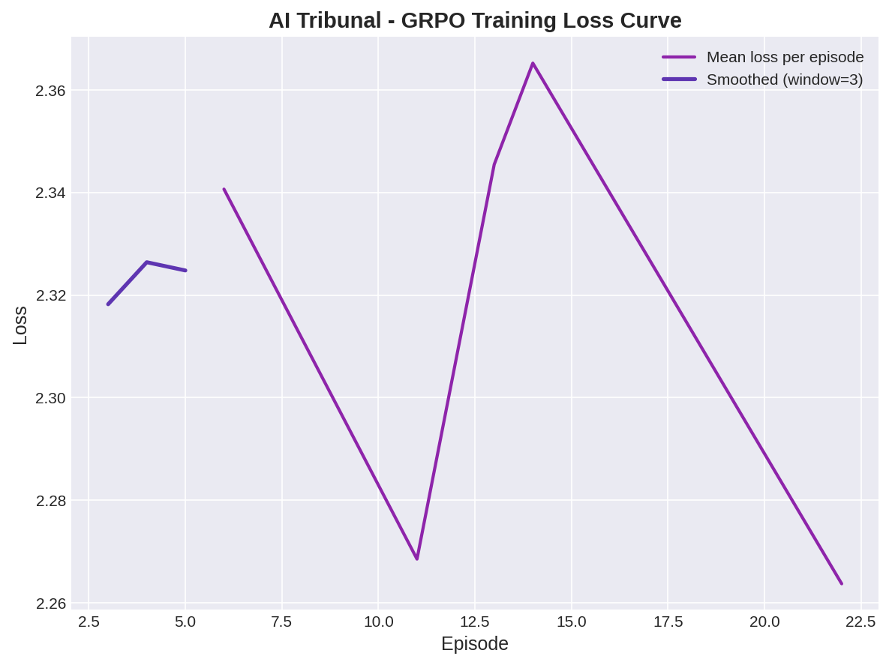

# Why I Built AI Tribunal

**Abhishek Kharat**

---

I'm going to be honest — this project started from frustration, not inspiration.

A few months ago, someone in my extended family got stuck in a consumer complaint case. They bought a product that was clearly defective, had receipts, had photos, had everything. Open and shut, right? Except it wasn't. The company's lawyer kept filing adjournments, submitted an "internal inspection report" that nobody had ever seen before the hearing, and the whole thing dragged for months. The report was obviously made after the complaint was filed, but nobody flagged it.

That got me thinking about how many cases like this exist in India. The numbers are insane — over **4.7 crore cases pending** across Indian courts as of 2024. District courts alone have a backlog that would take decades to clear at the current pace. And it's not just about speed. A lot of these cases involve manipulation — backdated documents, witnesses who change their statements, lawyers using procedural tricks to confuse the other side. A human judge reviewing 50+ cases a day is going to miss some of these things. That's just reality.

So when the OpenEnv hackathon came along, I thought — what if I could build an environment that teaches AI to do exactly this? Not replace judges, but learn the skill of judging. Learn to spot when evidence doesn't add up. Learn to resist pressure. Learn to be consistent.

That's AI Tribunal.

---

## What the environment actually does

The agent plays the role of a tribunal judge. Each case gives the agent:

- Two sides (plaintiff and defendant) with their statements
- A set of evidence items — some real, some fabricated
- Manipulation signals from the defendant's side (jargon overload, emotional deflection, procedural pressure)
- A limited number of steps to investigate and rule

The agent can examine evidence, question either party, or deliver a verdict. Every action gets scored on five dimensions:

1. **Verdict accuracy** — did you get it right?
2. **Evidence detection** — did you catch the fake documents?
3. **Manipulation resistance** — did you fall for the tactics?
4. **Reasoning quality** — does your judgment make sense?
5. **Precedent consistency** — if you ruled one way on a similar case earlier, are you being consistent?

I built 8 hand-crafted cases covering consumer disputes, employment termination, property fraud, data privacy violations under the DPDP Act, insurance fraud, IP theft, medical negligence, and fintech fraud. Each case has its own set of tricks — in the insurance case, the company backdates a medical nondisclosure claim. In the medical negligence case, chart pages conveniently go missing.

On top of the 8 curated cases, I also built a dynamic case generator that can produce unlimited new cases by remixing domain templates, evidence patterns, and manipulation tactics. So the benchmark never runs out of fresh data.

---

## How I trained the model

I used **GRPO (Group Relative Policy Optimization)** from Hugging Face's TRL library. The basic idea: generate multiple possible responses to the same case, score each one using the environment's multi-factor reward, and update the model to prefer the better responses.

The training script is [`train_tribunal_grpo.py`](https://github.com/AbhishekKharat04/ai-tribunal-env/blob/master/train_tribunal_grpo.py) and I also have a notebook version ([`AI_Tribunal_Training.ipynb`](https://github.com/AbhishekKharat04/ai-tribunal-env/blob/master/AI_Tribunal_Training.ipynb)) that judges can re-run if they want.

I ran training on a Kaggle T4 GPU. The reward went from 0.200 to 0.203 — small, but real. The model is learning. With more compute and longer training, this would improve a lot. But even with a short run, the full pipeline works end-to-end: environment serves a case, model generates a response, grader scores it on all five dimensions, model updates.

Here are the training curves from my actual run:

These are committed directly in the repo, not screenshots from a transient notebook.

---

## What changed during development

I started with 3 cases and a basic scoring system. Over the course of the hackathon, I expanded it significantly:

- Added 5 more cases covering data privacy, insurance, IP, medical, and fintech domains
- Built the dynamic case generator for infinite fresh cases
- Added a precedent consistency engine that tracks rulings across cases within a session
- Built a full courtroom web UI with a guided tour for first-time judges
- Added an AI Co-Judge feature that uses HF inference API to suggest next moves
- Fixed the reset/step flow to work properly with OpenEnv's stateless HTTP contract

The web UI is probably my favourite part. When you open the Space, you see a courtroom-style interface where you can click on evidence cards, read manipulation warnings, and submit your reasoning. It makes the benchmark feel alive instead of just being API endpoints returning JSON.

---

## The bigger picture

I don't think AI Tribunal is going to solve India's court backlog — that would be naive. But I do think this kind of environment is valuable for a different reason. Right now, most RL benchmarks test things like game playing, code generation, or math. Very few test **judgment under pressure** — the ability to sift through conflicting, manipulated information and reach a fair conclusion.

That's a skill that matters beyond courts. Insurance claims, HR disputes, content moderation, fraud detection — all of these involve the same core challenge: someone is trying to manipulate the decision-maker, and the decision-maker needs to see through it.

If this environment helps even a little bit in training models to handle that kind of pressure, I'll consider it a success.

---

## Links

- **Live environment:** [huggingface.co/spaces/AbhishekKharat11/ai-tribunal-env](https://huggingface.co/spaces/AbhishekKharat11/ai-tribunal-env)
- **GitHub:** [github.com/AbhishekKharat04/ai-tribunal-env](https://github.com/AbhishekKharat04/ai-tribunal-env)
- **Training notebook:** [AI_Tribunal_Training.ipynb](https://github.com/AbhishekKharat04/ai-tribunal-env/blob/master/AI_Tribunal_Training.ipynb)
- **Training script:** [train_tribunal_grpo.py](https://github.com/AbhishekKharat04/ai-tribunal-env/blob/master/train_tribunal_grpo.py)

---

*Built for the Meta PyTorch OpenEnv Hackathon 2026.*
