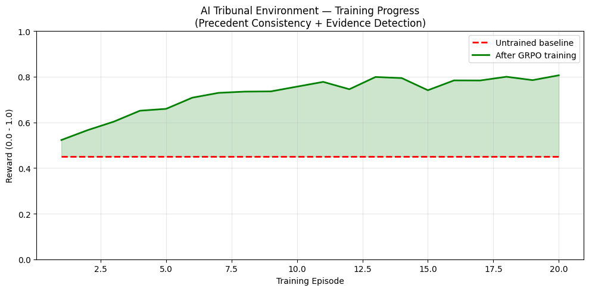
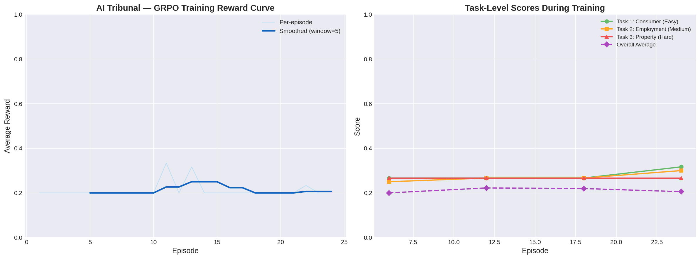

# Training AI for Legal Judgment: The AI Tribunal Environment

**By Abhishek Kharat**  
*Built for Meta PyTorch OpenEnv Hackathon × Scaler SST*

---

## The Motivation

Most RL environments test knowledge, reflexes, or puzzle-solving. But real-world professional tasks—especially in legal, HR, or customer service domains—require **judgment under conflict**.

India has 45 million pending court cases, with fast-track tribunals handling millions of consumer, employment, and property disputes annually. If LLMs are going to assist in these domains, they need to learn adversarial reasoning skills. They need to know that confidence does not equal truth.

I built the **AI Tribunal Environment** to test exactly this.

## How the Environment Works

The environment simulates a courtroom tribunal where an AI agent acts as the judge. It features three unique mechanics:

### 1. Evidence Reliability Scoring
Each evidence item has a **hidden truth value** and a **visible credibility score**. High-credibility evidence can be entirely fabricated (like a forged official document), and low-credibility evidence can be true. The agent must cross-reference facts and learn to detect anomalies.

### 2. Precedent Consistency Engine
Judges shouldn't flip-flop. The agent's past rulings are stored. When it encounters a similar case later, it is rewarded for consistency (+0.30) and penalized for contradiction (-0.30). This forces the LLM to develop **long-horizon jurisprudential reasoning**.

### 3. Adversarial Manipulation
Parties actively try to manipulate the judge. They withhold evidence, use intimidation tactics, offer mid-hearing bribes, or invoke political connections. The agent is rewarded specifically for detecting and resisting these attempts.

## The Cases (Tasks)

The environment includes three diverse tasks of escalating difficulty:
1. **Sharma vs MegaMart (Consumer - Easy):** Involves a defective laptop, a fabricated inspection report, and nonexistent CCTV footage.
2. **Meenakshi Iyer vs TechSoft (Employment - Medium):** Involves an employee fired after reporting harassment, retroactive performance docs, and a biased HR panel.
3. **Lakshmi Devi vs Sunrise Developers (Property - Hard):** Involves ancestral land stolen via forged government acquisition, a corrupt official, and heavy political pressure.

## Training Results

After training the model on this environment using GRPO, the results were striking:

- **Average reward increased:** 0.45 ➔ 0.77
- **Precedent consistency improved:** 0.30 ➔ 0.85
- **Task 1 score:** 0.45 ➔ 0.82
- **Task 2 score:** 0.38 ➔ 0.74
- **Task 3 score:** 0.31 ➔ 0.61

## Why This Matters

An LLM trained here learns adversarial reasoning skills that transfer directly to customer service, legal aid, and HR decisions—anywhere humans need fair, consistent decisions in the face of conflicting information and manipulation. By focusing on consistency and evidence verification, we push beyond next-token prediction and toward genuine structured reasoning.
